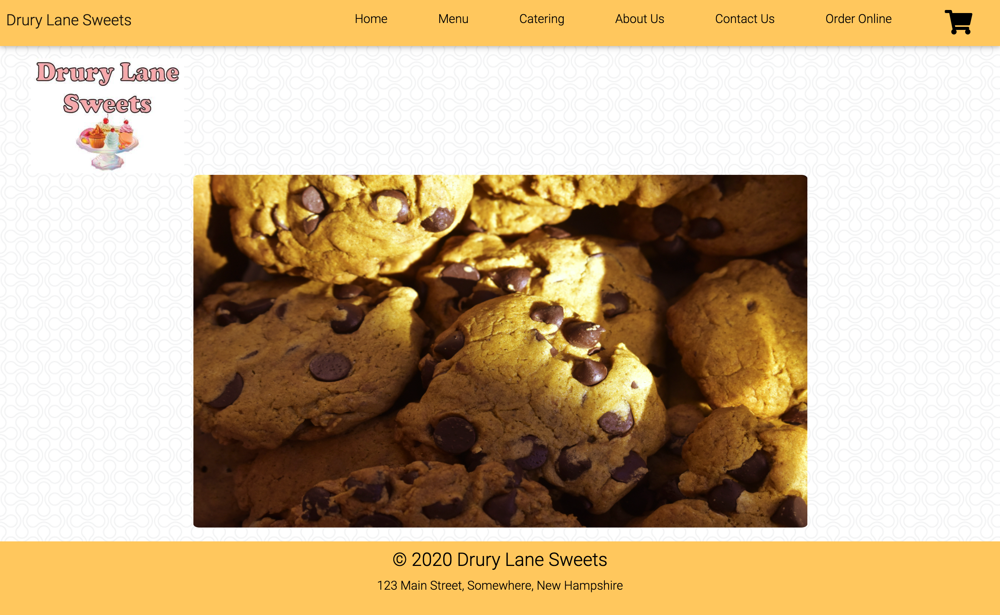

# Drury-Lane-Sweets
# Description:
Drury Lane Sweets is a local small business for baked goods. We make cakes, cupcakes, cookies, donuts, and pies. We also cater events customized to your needs. We created a dynamic website for our business. You can order online, payment feature to be added soon. You can find nutrition info on our menu page. You can find our location on a map on our contact us page. We believe online ordering is very important in this day and age. We want people to be able to have treats delivered to their house. We also like customizing treats for events. We are motivated to cater to our customers and make them full of desserts

# User Story: 
As a person with a sweet tooth,
I want to order desserts online from a local bakery,
So that I can satiate my dessert craving at home.

# Links
-GitHub: https://github.com/shannonquinn91/Drury-Lane-Sweets
-Deployed Page: https://shannonquinn91.github.io/Drury-Lane-Sweets/ 

# Technologies Used: 
HTML, CSS, JavaScript, JQuery, AJAX, Google Fonts, Font Awesome, Slack, GitHub, Balsamiq

# Framework: 
Material Design Bootstrap

# API:
NutritionIX, Mapbox

# Tasks
Wireframe: Team
Home Page: Team
Menu Page: David
Catering Page: Jesal
About Us Page: Brenda
Contact Us Page: Amy
Cart/Online Order: Shannon

# Challenges
-Switched framework from Semantic to MDBootstrap for better responsiveness
-Finding usable APIs
-GitHub merging

# Successes
-Carousel on home page 
-API functionality with modals
-Cart/online order functionality
-Nav bar responsiveness
-Local storage functionality

# In the future we would like to add/improve:
-Online billing and payment system
-User login functionality
-User database
-Expand menu
-Handling use cases
-Improved order tracking

